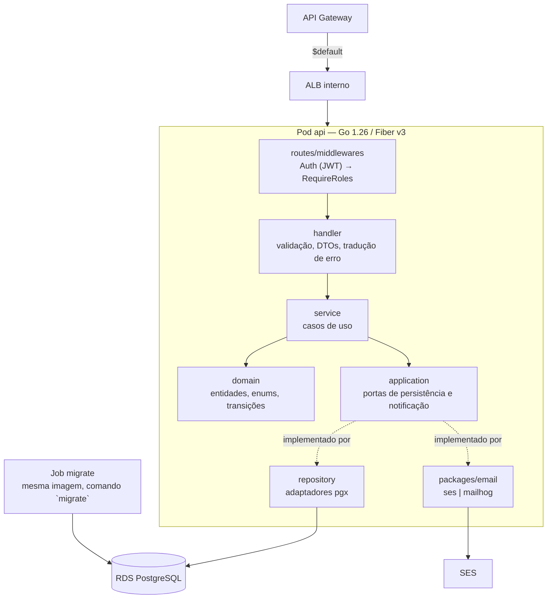
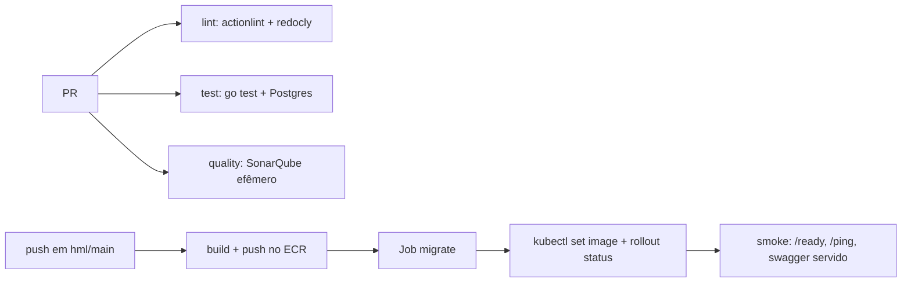

# oficina-mecanica-monolith

API REST de gerenciamento da oficina: ordens de serviço, orçamentos, catálogos
(clientes, veículos, serviços, insumos, etc) e manutenção administrativa de usuários.

Go 1.26 + Fiber v3, arquitetura hexagonal, PostgreSQL. Roda no EKS.

> **Visão de arquitetura do sistema completo** (os quatro repositórios, o
> diagrama de componentes, as camadas de Terraform e o fluxo de deploy) vive em
> [`oficina-mecanica-infrastructure`](https://github.com/SOAT-15-Oficina/oficina-mecanica-infrastructure).
> Este README cobre apenas este repositório.

## O que este serviço **não** faz

| Responsabilidade | Onde vive |
|---|---|
| `POST /auth/login`, `POST /auth/register` | [`oficina-mecanica-serverless`](https://github.com/SOAT-15-Oficina/oficina-mecanica-serverless) (Lambda) |
| Painel web | [`oficina-mecanica-frontend`](https://github.com/SOAT-15-Oficina/oficina-mecanica-frontend) (S3 + CloudFront) |
| Criação de qualquer recurso AWS ou objeto Kubernetes | [`oficina-mecanica-infrastructure`](https://github.com/SOAT-15-Oficina/oficina-mecanica-infrastructure) |

Este serviço **valida** o JWT emitido pela Lambda (`internal/routes/middlewares`)
e aplica RBAC, mas nunca o emite em produção. A cópia de `AppClaims`/`ParseToken`
em `internal/auth` é intencional — os dois repositórios são independentes, e um
teste de contrato (`internal/auth/claims_test.go`) protege contra divergência.

## Arquitetura deste repositório



As dependências apontam para dentro: `handler` → `service` → `domain`. O que fala
com o mundo (`repository`, `packages/email`) implementa portas declaradas em
`application`, e é injetado em `routes/main.go`. `domain` não importa nada dos
outros pacotes.

**Fluxo de deploy deste repositório:**



## Contrato da API

| | |
|---|---|
| OpenAPI (fonte) | [`docs/swagger.yaml`](docs/swagger.yaml) |
| Swagger UI (ambiente no ar) | `<URL_PUBLICA>/api/docs` |
| Especificação servida pela aplicação | `<URL_PUBLICA>/api/docs/swagger.yaml` |
| Local | http://localhost:8080/docs |

O contrato cobre a API de negócio. `POST /auth/login` e `POST /auth/register`
têm contrato próprio no
[`oficina-mecanica-serverless`](https://github.com/SOAT-15-Oficina/oficina-mecanica-serverless/blob/main/docs/openapi.yaml).

`internal/routes/openapi_test.go` falha o build se uma rota registrada não
estiver no swagger, ou vice-versa. O pipeline ainda compara byte a byte o arquivo
do repositório com o que o pod serve, no smoke check.

## Deploy ativo

O ambiente é **efêmero** — sobe sob demanda e desce depois
([ADR-0006](https://github.com/SOAT-15-Oficina/oficina-mecanica-infrastructure/blob/main/docs/adr/0006-duas-camadas-de-terraform.md)).
A URL pública é estável entre ciclos e fica no SSM:

```bash
aws ssm get-parameter --name /oficina-mecanica/prod/public_base_url \
  --query Parameter.Value --output text
```

| Ambiente | URL |
|---|---|
| Produção | `/oficina-mecanica/prod/public_base_url` |
| Homologação | `/oficina-mecanica/homolog/public_base_url` |

## Estrutura

```
cmd/api/            main: modo servidor e modo `migrate`
database/           migrations goose (go:embed) + seed
docs/swagger.yaml   contrato OpenAPI (sem /auth/*)
internal/
  auth/             AppClaims + ParseToken/GenerateToken (contrato do token)
  application/      portas de persistência e notificação, erros de aplicação
  domain/           entidades e enums
  handler/          HTTP: validação, DTOs, tradução de erros
  observability/    slog JSON, taxonomia de campos (ADR-0011) e tracer do APM
  repository/       adaptadores pgx
  routes/           registro de rotas e middlewares
  service/          casos de uso
packages/email/     provider de e-mail (mailhog | ses) + templates
tests/tools/token/  emite um JWT de desenvolvimento sem a Lambda
```

## Observabilidade

Toda linha de log é JSON, com os mesmos nomes de campo da Lambda de
autenticação. Quem define esses nomes é a [ADR-0011][adr11] no repositório de
infraestrutura, e não este repositório: eles são lidos literalmente pelas
métricas de log, pelos painéis e pelos alertas do Datadog
(`persistent/datadog_metrics.tf`, `persistent/datadog_monitors.tf`). Renomear um
campo aqui compila, passa nos testes e esvazia um painel em silêncio — por isso
os nomes vivem em constantes, em `internal/observability`, e há teste sobre
eles.

| Campo | De onde vem |
|---|---|
| `service`, `env` | `DD_SERVICE` / `DD_ENV`, injetadas pelo Terraform |
| `version` | SHA do commit, gravado na imagem pelo linker (`--build-arg VERSION`) |
| `request_id` | header `X-Request-Id`, ou gerado |
| `route`, `method`, `status`, `duration_ms` | linha de acesso, uma por requisição |
| `event` | evento de domínio — `work_order.created` e companhia |
| `integration` | dependência externa em `level=ERROR` — `ses`, `rds` |
| `work_order_id`, `work_order_code`, `from`, `to`, `decision` | contexto do evento |

**O `request_id` é herdado da borda.** O API Gateway injeta o próprio
`$context.requestId` como header (*parameter mapping*, no repositório de
infraestrutura), então o identificador do access log da borda **é** o das linhas
de dentro do pod. Uma consulta por `@request_id` devolve o rastro inteiro.

O middleware lê o **último** valor do header, não o primeiro: o gateway usa
`append:`, então um `X-Request-Id` mandado pelo cliente vem antes. Só o último
nasceu na borda — e o valor passa por um filtro de caracteres antes de virar
header de resposta, tag de traço e campo de log.

**Eventos de domínio, não texto de mensagem.** O nome do evento vai em `event`;
`msg` é texto para humano e muda na primeira refatoração. É `@event` que as
métricas contam e os alertas consultam — inclusive o alerta de falha no
processamento de OS, que dispara com `@event:work_order.transition_rejected` ou
com qualquer `ERROR` que carregue `@work_order_id`.

**`/ping` e `/ready` não geram linha de acesso.** O kubelet os chama a cada
poucos segundos em cada pod: seriam centenas de milhares de linhas por dia
dizendo que nada aconteceu. O uptime vem do teste sintético, que olha de fora.

**APM.** Com `DD_TRACE_ENABLED=true`, o middleware abre um span por requisição e
o `dd.trace_id` entra em cada linha de log. Sem a variável, nenhum tracer sobe —
local não há agente para receber traço.

**Nunca entram em log:** senha, hash, o token, o segredo do JWT e o `document`
do cliente (CPF/CNPJ é dado pessoal — usa-se `customer_id`).

[adr11]: https://github.com/SOAT-15-Oficina/oficina-mecanica-infrastructure/blob/main/docs/adr/0011-logs-estruturados-com-correlacao.md

## Rodando local

```bash
cp .env.example .env      # ajuste JWT_SECRET_KEY
docker compose up --build
```

Sobe API (`:8080`), Postgres e MailHog (UI em `:8025`). As migrations rodam num
container one-shot antes da API — **não** no boot dela.

Como este compose não inclui a Lambda, não há `/auth/login`. Gere um token:

```bash
JWT_SECRET_KEY=<mesmo do .env> go run ./tests/tools/token -role admin
curl -H "Authorization: Bearer <token>" localhost:8080/customers
```

Para o fluxo completo (front + Lambda + monolito atrás de um nginx que replica o
roteamento do CloudFront), use `docker-compose.local.yml` no repositório de
infraestrutura.

## Testes

```bash
go test ./...                                # exige Postgres para os de integração
go test ./... -short                         # apenas unitários
go test ./... -coverprofile=coverage.out
```

Os testes de integração em `internal/handler/` sobem o schema real via goose e
semeiam o usuário direto na tabela `users` — o cadastro por HTTP migrou para a
Lambda, e o monolito só consome `users` para resolver quem abriu a OS.

## Qualidade

```bash
docker compose -f docker-compose.sonar.yml up -d sonarqube
go test ./... -coverprofile=coverage.out
docker compose -f docker-compose.sonar.yml run --rm sonar-scanner
```

O CI sobe uma instância equivalente como service container efêmero e o Quality
Gate **bloqueia o merge**. Como não há histórico entre execuções, o gate é
avaliado sobre o código todo, não sobre *new code*.

## Pipeline

| Gatilho | O que roda |
|---|---|
| PR → `main` ou `hml` | actionlint, `redocly lint`, `go test` com cobertura, SonarQube + Quality Gate |
| Push → `main` ou `hml` | build da imagem, push no ECR, Job de migration, `kubectl set image`, rollout, smoke check |

O deploy autentica por **OIDC** (sem access key) e resolve todos os nomes de
recurso no **SSM Parameter Store**, publicado pelo repositório de infraestrutura:

| Parâmetro | Uso |
|---|---|
| `/oficina-mecanica/<ambiente>/ecr_repository_url` | destino do `docker push` |
| `/oficina-mecanica/<ambiente>/eks_cluster_name` | `aws eks update-kubeconfig` |
| `/oficina-mecanica/<ambiente>/kube_namespace` | namespace do Deployment |
| `/oficina-mecanica/<ambiente>/api_deployment_name` | alvo do `set image` |

O `Deployment` é criado pelo Terraform com `lifecycle.ignore_changes` no campo
`image`: a **tag** é propriedade deste pipeline, o **resto do manifesto** é
propriedade do repositório de infraestrutura. Um `terraform apply` nunca reverte
um release, e um deploy daqui nunca altera probes, recursos ou HPA.

### Dois ambientes

A **branch** escolhe o destino: `hml` publica em homologação, `main` em produção.
Não há input de ambiente em lugar nenhum deste repositório — o `ref` já carrega a
informação, e um input separado poderia contradizê-lo.

| | homologação | produção |
|---|---|---|
| Branch | `hml` | `main` |
| GitHub Environment | `homolog` | `production` |
| Prefixo no SSM | `/oficina-mecanica/homolog` | `/oficina-mecanica/prod` |

Por isso `AWS_DEPLOY_ROLE_ARN` é secret de **GitHub Environment**, não de
repositório: os dois ambientes usam o mesmo nome de secret e apenas o escopo do
Environment os separa. A trust policy da role repete a regra do lado da AWS — um
push em `hml` não obtém credencial de produção.

Arquitetura completa dos dois ambientes: `oficina-mecanica-infrastructure`.

### Secrets e variables necessários

| Nome | Tipo | Conteúdo |
|---|---|---|
| `AWS_DEPLOY_ROLE_ARN` | secret de **Environment** (`production` e `homolog`) | role assumida por OIDC |
| `CI_DATABASE_PASSWORD` | secret | senha do Postgres do job de teste |
| `AWS_REGION` | variable | `sa-east-1` |

## Variáveis de ambiente

Ver `.env.example`. Quatro merecem atenção:

- **`JWT_SECRET_KEY`** — precisa ser byte a byte o mesmo valor da Lambda. Em
  produção vem do Secrets Manager via `kubernetes_secret`.
- **`APP_BASE_URL`** — usada para montar os links de aprovação enviados ao
  cliente por e-mail (`internal/service/budget_service.go`). Em produção é o
  domínio do CloudFront seguido de `/api`.
- **`DD_ENV`** — decide o **formato** do log, não só a tag: sem ela o handler é
  texto (legível no terminal), com ela é JSON. Errar isso não dá erro visível,
  só um painel vazio.
- **`DD_TRACE_ENABLED`** — `true` exige um agente alcançável em `DD_AGENT_HOST`.
  Sem a variável nenhum tracer sobe, e a aplicação funciona igual.

## E-mail

`EMAIL_PROVIDER=mailhog` apenas no ambiente local. **Nos dois ambientes da
nuvem — homologação e produção — o provider é `ses`**, fixado no ConfigMap pela
camada efêmera do `oficina-mecanica-infrastructure`. Não há valor padrão nem
fallback: provider desconhecido faz o processo falhar no boot
(`packages/email/email.go`).

O provider SES usa a API v2 e resolve credenciais pela cadeia padrão do SDK — no
cluster isso cai no **IRSA** do ServiceAccount, então não existe access key em
lugar nenhum.

A conta tem **acesso de produção concedido** no SES (região `sa-east-1`), com
cota de 50.000 e-mails/24h a 14/segundo. Entrega para qualquer destinatário; o
que continua exigindo verificação é o **remetente** (`SES_SENDER_EMAIL`). Um
`MessageRejected` ainda é possível — remetente não verificado, destinatário em
lista de supressão, conta pausada — e o provider propaga esse erro em vez de
engolir.
